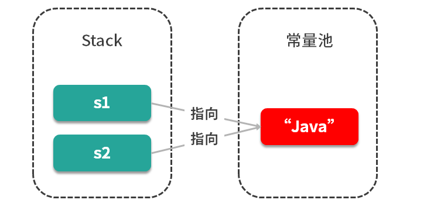
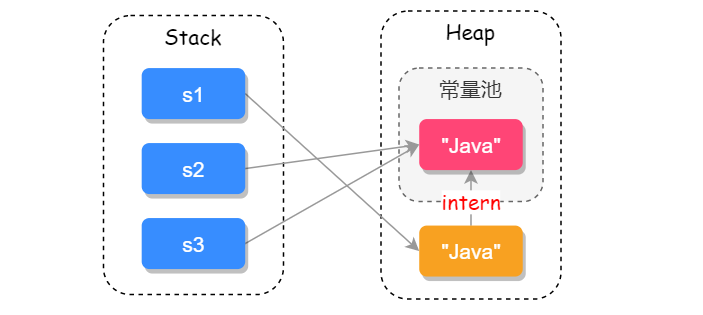

本文主要从源码出发，介绍了 String 的一些特点和方法。包括了 String 的底层实现，源码中的几个重要方法实现，String 使用 final 修饰的原因，String 与 StringBuilder、StringBuffered 的区别，String 在 JVM 中的存储，intern() 方法，不可变性，+ 的重载以及编译器使用 StringBuilder 的优化。

<!--more-->

## 1. String 如何实现

以主流的 JDK 版本 1.8 来说，String 内部实际存储结构为 char 数组，源码如下：

```java
public final class String
    implements java.io.Serializable, Comparable<String>, CharSequence {
    /** The value is used for character storage. 用于储存字符串的值*/
    private final char value[];

    /** Cache the hash code for the string 缓存字符串的Hash Code*/
    private int hash; // Default to 0
    .....
```

在 Java 9 之后，String 类的实现改用 byte 数组存储字符串 `private final byte[] value`

## 2. String 源码中的几个重要方法

### 2.1 多构造方法

如下选出源码中 String 比较重要的几个构造方法：

``` java
// String 为参数的构造方法
public String(String original) {
    this.value = original.value;
    this.hash = original.hash;
}
// char[] 为参数构造方法
public String(char value[]) {
    this.value = Arrays.copyOf(value, value.length);
}
// StringBuffer 为参数的构造方法
public String(StringBuffer buffer) {
    synchronized(buffer) {
        this.value = Arrays.copyOf(buffer.getValue(), buffer.length());
    }
}
// StringBuilder 为参数的构造方法
public String(StringBuilder builder) {
    this.value = Arrays.copyOf(builder.getValue(), builder.length());
}
```

### 2.2 equals() 比较两个字符串是否相等

[Object 的 equals 方法以及与 == de 区别更详细解释请参考](https://www.cnblogs.com/skywang12345/p/3324958.html)

Object 的 equals() 方法源码如下：

```java
public boolean equals(Object obj) {
    return (this == obj);
}
```

String 的 equals() 方法重写了 Object 的 equals() 方法，equals() 方法需要传递一个 Object 类型的参数值，在比较时先判断对比的值是否为 String 类型，如果不是直接返回false，如果是继续判断，具体源码如下：

```java
public boolean equals(Object anObject) {
    //对象引用相同，直接返回
    if (this == anObject) {
        return true;
    }
    //判断对比的值是否为String类型
    if (anObject instanceof String) {
        String anotherString = (String)anObject;
        int n = value.length;
        if (n == anotherString.value.length) {
            //把两个字符串转为 char[] 数组对比
            char v1[] = value;
            char v2[] = anotherString.value;
            int i = 0;
            while (n-- != 0) {
                if (v1[i] != v2[i])
                    return false;
                i++;
            }
            return true;
        }
    }
    return false;
}
```

还有一个和 equals() 比较类似的方法 equalsIgnoreCase()，它是用于忽略字符串的大小写之后进行字符串对比。

**equals() 和 == 的区别：**

1. == 对于基本数据类型来说，是比较**值**是否相等的；对于引用类型来说，是用于比较**引用地址**是否相等的
2. 从 Object 的 equals() 方法源码来看，对于 Object 而言，equals() 方法其实就是 ==, 而 String 重写了 equals() 方法，用于比较两个字符串的值是否相等。

### 2.3 compareTo() 比较两个字符串

用于两个字符串的字典序比较，返回 int 类型的值，源码如下：

```java
public int compareTo(String anotherString) {
    int len1 = value.length;
    int len2 = anotherString.value.length;
    int lim = Math.min(len1, len2);
    char v1[] = value;
    char v2[] = anotherString.value;

    int k = 0;
    while (k < lim) {
        char c1 = v1[k];
        char c2 = v2[k];
        if (c1 != c2) {
            return c1 - c2;
        }
        k++;
    }
    return len1 - len2;
}
```

还有一个和 compareTo() 比较类似的方法 compareToIgnoreCase()，用于忽略大小写后比较两个字符串。

**equals() 和 compareTo() 方法的区别：**

1. equals() 可以接收一个Object类型的参数，而compareTo() 只接受String
2. equals 返回值为 boolean, compareTo 返回 int

### 2.4 其他重要方法

```bash
indexOf()：查询字符串首次出现的下标位置
lastIndexOf()：查询字符串最后出现的下标位置
contains()：查询字符串中是否包含另一个字符串
toLowerCase()：把字符串全部转换成小写
toUpperCase()：把字符串全部转换成大写
length()：查询字符串的长度
trim()：去掉字符串首尾空格
replace()：替换字符串中的某些字符
split()：把字符串分割并返回字符串数组
join()：把字符串数组转为字符串
```

## 3. 为什么 String 类型用 final 修饰？

从 String 类的源码来看，String 是被 final 修饰的不可继承类，源码如下：

```java
public final class String
    implements java.io.Serializable, Comparable<String>, CharSequence {
    ...
```

那这样设计有什么好处呢？

Java 语言之父 James Gosling 的回答是，他会更倾向于使用 final，因为它能够缓存结果，当你在传参时，不需要考虑谁会修改它的值；如果是可变的话，则有可能需要重新拷贝出来一个新值进行传参，这样在性能上有一定的损失。

James Gosling 还说迫使 String 类设计成不可变的另一个原因是**安全**。当你在调用其他方法时，比如在调用一些系统级操作指令之前，可能会有一系列校验，如果是可变的话，可能在你校验之后，它的内部值又被改变了，这样可能引起严重的系统崩溃问题，这是迫使 String 类设计为不可变类的一个重要原因。

总结来说，使用 final 修饰的第一个好处是**安全**，第二个好处是**高效**。我们以 JVM 中的字符串常量池为例，有如下两个变量：

```java 
String s1 = "java";
String s2 = "java";
```

只有字符串是不可变时，我们才能实现字符串常量池，它可以为我们缓存字符串，提高程序运行效率。



试想如果 String 是可变的，那当 s1 的值修改之后，s2 的值也会跟着改变，这样就和我们预期的结果不符合，因此也就没有办法实现字符串常量池的功能了。

## 4. String 和 StringBuilder、StringBuffer 的区别

### （1） 可变性

上文提到，String 类中使用 final 关键字修饰字符数组来保存字符串，`private final char value[]`，所以 String 对象是不可变的。

但StringBuilder 与 StringBuffer 都继承自 AbstractStringBuilder 类，在 AbstractStringBuilder 中也是使用字符数组保存字符串`char[]value` 但是没有用 final 关键字修饰，StringBuilder 与 StringBuffer 的构造方法都是调用父类构造方法，所以这两种对象都是可变的。AbstractStringBuilder 的源码如下：

```java
abstract class AbstractStringBuilder implements Appendable, CharSequence {
    /**
     * The value is used for character storage.
     */
    char[] value;

    /**
     * The count is the number of characters used.
     */
    int count;
    ...
```

### （2）线程安全性

String 中的对象是不可变的，也就可以理解为常量，线程安全。AbstractStringBuilder 是 StringBuilder 与 StringBuffer 的公共父类，定义了一些字符串的基本操作，如 expandCapacity、append、insert、indexOf 等公共方法。

StringBuffer 对方法加了同步锁或者对调用的方法加了同步锁 synchronized，所以是线程安全的。StringBuilder 并没有对方法进行加同步锁，所以是非线程安全的。源码如下：

```java
// StringBuffer 截取部分源码
@Override
public synchronized StringBuffer append(String str) {
    toStringCache = null;
    super.append(str);
    return this;
}
// StringBuilder 截取部分源码
@Override
public StringBuilder append(String str) {
    super.append(str);
    return this;
}
```

### （3）性能

因为 String 类型是不可变的，所以每次对 String 类型进行改变的时候，都会生成一个新的 String 对象，然后将引用指向新的 String 对象。StringBuffer 每次都会对 StringBuffer 对象本身进行操作，而不是生成新的对象并改变对象引用。相同情况下使用 StringBuilder 相比使用 StringBuffer 性能更高一些，但却线程不安全的风险，因而我们可以再非并发操作的环境下使用 StringBuilder 操作字符串。

### （4）对于三者使用的总结

			- 操作少量的数据: 适用 String
			- 单线程操作字符串缓冲区下操作大量数据: 适用 StringBuilder
			- 多线程操作字符串缓冲区下操作大量数据: 适用 StringBuffer

## 5. String 在 JVM（Java虚拟机）中是如何存储的？

String常见的创建方式有两种，直接赋值的方式``Strings1 = "Java";``和``Strings2 = new String("Java");``的方式，但两者在JVM的存储区域却截然不同，在JDK1.8中，变量 s1 会先去**字符串常量池**中找字符串“Java”，如果有相同的字符则直接返回**常量句柄**（一个唯一的整数，作为对象的身份id, 区分不同的对象和同类中的不同实例），如果没有此字符串则会先在常量池中创建此字符串，然后再返回常量句柄；而变量 s2 是直接在堆上创建一个变量，如果调用 intern 方法才会把此字符串保存到常量池中，它们在 JVM 中的存储位置如下图所示：



代码演示如下：

```java
Strings1 = newString("Java");
Strings2 = s1.intern();
Strings3 = "Java";
System.out.println(s1 == s2); // false
System.out.println(s2 == s3); // true
```

## 6. String 的 intern 方法有什么含义?

public String **intern**() 返回字符串对象的规范化表示形式，返回值是一个字符串，内容与此字符串相等，但它保证来自字符串池中。

一个初始为空的字符串池，它由类 String 私有地维护。当调用 intern 方法时，如果字符串池中已经包含一个等于此 String 对象的字符串（是否等于由 String 的 equals 方法来确定），则返回池中的字符串；否则将此 String 对象添加到池中，并且返回此 String 对象的引用。所有的字面值字符串和字符串赋值常量表达式都是内部的。

如下例子中，变量 str1 会先去字符串常量池中找字符串 "ab", 如果有相同的字符串则直接返回常量句柄，如果没有此字符串则会先在常量池中创建此字符串，然后再返回常量句柄；而变量 str2 是直接在堆上创建一个变量，如果调用 intern 方法才会把此字符串保存到常量池中。

字符串相加的时候，都是静态字符串的结果会添加到字符串池，如果其中含有变量（如 str3 str4）则不会进入字符串池中。

```java
String str1 = "ab";
String str2 = new String("ab");
System.out.println(str1 == str2);           //false 引用地址不同
System.out.println(str1.equals(str2));      //true 字符串值相同
System.out.println(str1 == str2.intern());  //true
String str3 = "a";
String str4 = "b";
System.out.println(str3 + str4 == str1);    //false
System.out.println("a" + "b" == str1);      //true
```

前文中说明了 equals 和 == 的区别，对于 String 而言，== 判断的是引用地址，那么什么时候会出现引用地址相同的情况呢？现在来看，如果给变量赋值的是静态字符串，就会在字符串中找相同字符串，如果有返回引用，这时候就存在相同的引用地址；而 new String 构造的字符串用 == 判断一定是 false。

```java
String str5 = new String("ab");
System.out.println(str2 == str5);           //false
String str6 = "ab";
System.out.println(str1 ==str6);            //true
```

## 7. String 的不可变

String 对象是不可变的。从 JDK 文档可以发现，String 类中每一个看起来会修改 String 值的方法，实际上都是创建了一个全新的 String 对象来包含修改后的字符串内容，而最初的 String 对象纹丝未动。

例如下面的代码：

```java
public static String upcase(String s) {
    return s.toUpperCase();
}
public static void main(String[] args) {
    String q = "howdy";
    System.out.println(q); // howdy 
    String qq = upcase(q);
    System.out.println(qq); // HOWDY 
    System.out.println(q); // howdy 
}
```

当把 ``q``传递给``upcase()``方法时，实际传递的是引用的一个拷贝。每当 String 对象作为方法的参数时，都会复制一份引用，而该引用所指的对象一直在物理位置上没有任何变化。

回到 upcase() 的定义，传入其中的引用有了名字 s, 只有 upcase() 方法运行时局部引用 s 才存在。一旦 upcase() 结束，s 就消失了。其返回值也就指向了一个新的对象，而 q 仍然在原来的位置。

## 8. + 的重载与 StringBuilder

String 对象是不可变的，你可以给一个 String 对象添加任意多的别名，因为 String 是只读的，所以指向它的任何引用都不可能修改它的值，这样也就不会影响到其他引用。

不可变性会带来一定的效率问题。为 String 对象重载的 + 操作符就是一个例子：操作符 + 可以连接 String。当使用 + 操作符时，编译器会做一定的优化，例如在下面的代码中：

```java
String mango = "mango"; 
String s = "abc" + mango + "def" + 47; 
```

编译器会自动引入``java.lang.StringBuilder``类（虽然源代码中并没有使用 StringBuilder 类，但因为其高效，编译器会使用它），先创建一个 StringBuilder 对象，对每个字符串调用一次 append 方法，共4次，最后调用 toString() 方法，存为 s。

现在你可能觉得可以随意使用 String 对象，反正编译器会为你做性能优化。在这之前让我们深入看看编译器会为我们优化到什么程度。下面例子中采用两种方式生成 String：

```java
public class WhitherStringBuilder { 
    public String implicit(String[] fields) { 
        String result = ""; 
        for(String field : fields) { 
            result += field;
        }
        return result; 
    }
    public String explicit(String[] fields) { 
        StringBuilder result = new StringBuilder(); 
        for(String field : fields) { 
            result.append(field); 
        } 
        return result.toString(); 
    }
}
```

第一种方式中，StringBuilder 是在循环体内部创建的，这意味着每进行一次循环，就会创建一个 StringBuilder 对象。第二种显示定义 StringBuilder 只生成一个 StringBuilder 对象。因此如果使用循环，且可能存在性能问题，那么最好自己创建一个 StringBuilder 对象。

