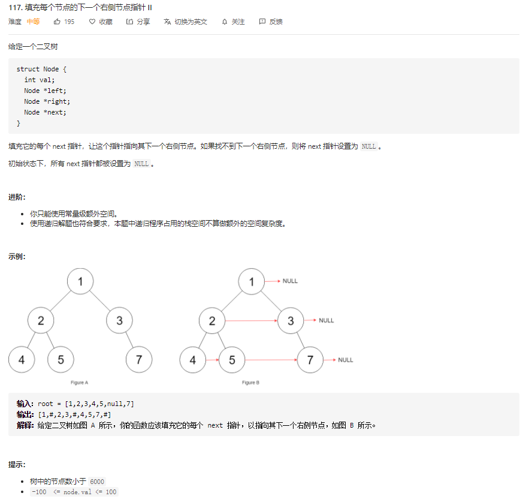

本文介绍了什么是二叉树，同时解决了部分LeetCode上二叉树相关的题目，这部分会持续更新。

## 1. 什么是二叉树？

[维基定义](https://zh.wikipedia.org/wiki/二叉树)：在计算机科学中，二叉树（英语：Binary tree）是每个节点最多只有两个分支（即不存在分支度大于2的节点）的树结构。通常分支被称作“左子树”或“右子树”。二叉树的分支具有左右次序，不能随意颠倒。

二叉树的第 ``i`` 层至多拥有 2<sup>i-1</sup> 个节点；深度为 k 的二叉树至多总共有 2<sup>k</sup>-1 个节点（定义根节点所在深度 k<sub>0</sub>=0}），而总计拥有节点数符合的，称为 **满二叉树**；深度为 k 有 n 个节点的二叉树，当且仅当其中的每一节点，都可以和同样深度 k 的满二叉树，序号为1到 n 的节点一对一对应时，称为 **完全二叉树**。对任何一棵非空的二叉树T，如果其叶片（终端节点）数为 n<sub>0</sub>，分支度为2的节点数为 n<sub>2</sub>，则 n<sub>0</sub> = n<sub>2</sub> + 1。

与普通树不同，普通树的节点个数至少为1，而二叉树的节点个数可以为0；普通树节点的最大分支度没有限制，而二叉树节点的最大分支度为2；普通树的节点无左、右次序之分，而二叉树的节点有左、右次序之分。

二叉树通常作为数据结构应用，典型用法是对节点定义一个标记函数，将一些值与每个节点相关系。这样标记的二叉树就可以实现二叉搜索树和二叉堆，并应用于高效率的搜索和排序。

<!--more-->

## 2. 二叉树相关的题目列表

|  #   |                            Title                             | Remark |
| :--: | :----------------------------------------------------------: | :----: |
|  94  | [二叉树的中序遍历](https://leetcode-cn.com/problems/binary-tree-inorder-traversal/) |        |
| 144  | [二叉树的前序遍历](https://leetcode-cn.com/problems/binary-tree-preorder-traversal/) |        |
| 145  | [二叉树的后序遍历](https://leetcode-cn.com/problems/binary-tree-postorder-traversal/) |        |
| 102  | [二叉树的层序遍历](https://leetcode-cn.com/problems/binary-tree-level-order-traversal/) |        |
| 107  | [二叉树的层次遍历 II](https://leetcode-cn.com/problems/binary-tree-level-order-traversal-ii/) |        |
| 104  | [二叉树的最大深度](https://leetcode-cn.com/problems/maximum-depth-of-binary-tree/) |        |
| 100  |   [相同的树](https://leetcode-cn.com/problems/same-tree/)    |        |
| 101  | [对称二叉树](https://leetcode-cn.com/problems/symmetric-tree/) |  Hard  |
| 103  | [二叉树的锯齿形层次遍历](https://leetcode-cn.com/problems/binary-tree-zigzag-level-order-traversal/) |  Hard  |
| 105  | [从前序与中序遍历序列构造二叉树](https://leetcode-cn.com/problems/construct-binary-tree-from-preorder-and-inorder-traversal/) |        |
| 106  | [从中序与后序遍历序列构造二叉树](https://leetcode-cn.com/problems/construct-binary-tree-from-inorder-and-postorder-traversal/) |        |
|  98  | [验证二叉搜索树](https://leetcode-cn.com/problems/validate-binary-search-tree/) |  Hard  |
|  99  | [恢复二叉搜索树](https://leetcode-cn.com/problems/recover-binary-search-tree/) |  Hard  |
| 108  | [将有序数组转换为二叉搜索树](https://leetcode-cn.com/problems/convert-sorted-array-to-binary-search-tree/) |        |
| 109  | [有序链表转换二叉搜索树](https://leetcode-cn.com/problems/convert-sorted-list-to-binary-search-tree/) |  Hard  |
| 110  | [平衡二叉树](https://leetcode-cn.com/problems/balanced-binary-tree/) |  Hard  |
| 114  | [二叉树展开为链表](https://leetcode-cn.com/problems/flatten-binary-tree-to-linked-list/) |  Hard  |
| 116  | [ 填充每个节点的下一个右侧节点指针](https://leetcode-cn.com/problems/populating-next-right-pointers-in-each-node/) |  Hard  |
| 117  | [填充每个节点的下一个右侧节点指针 II](https://leetcode-cn.com/problems/populating-next-right-pointers-in-each-node-ii/) |  Hard  |

### 2.1. 队列操作总结（LinkedList）

参考 [这里](https://blog.csdn.net/NRlovestudy/article/details/98666030)，具体操作如下：

```java
Deque<String> queue = new LinkedList<>();
// 尾部添加元素
queue.add("A");
queue.add("B");
queue.add("C");
System.out.println(queue); // [A, B, C]

// 获取但不删除第一个元素
String peek = queue.peek();
System.out.println(peek + " ## " + queue); // A ## [A, B, C]

// 获取并删除第一个元素，没有元素时会发生异常
String pop = queue.pop();
System.out.println(pop + " ## " + queue); // A ## [B, C]

// 获取并删除第一个元素，没有元素时返回null
String poll = queue.poll();
System.out.println(poll + " ## " + poll); // B ## B
```

总结：pop 与 poll 都是取出 LinkedList 的第一个元素，并将该元素删除，等效于 removeFirst；不同点：两者的实现所用数据结构不同：

- poll 是基于队列结构实现的方法，当队列中没有元素时，调用该方法返回 null
- pop 是基于栈结构实现的方法，当栈中没有元素时，调用该方法会发生异常

### 2.2. 栈操作总结（ArrayDeque）

```java
Deque<String> stack = new ArrayDeque<>();
// 入栈，即在首部添加元素
stack.push("A");
stack.push("B");
stack.push("C");
System.out.println(stack);      // [C, B, A]

// 获取栈顶元素，即第一个元素
System.out.println(stack.peek() + " ## " + stack); // C ## [C, B, A]

// 出栈，即获取并删除第一个元素
System.out.println(stack.pop() + " ## " + stack);    // C ## [B, A]
```

## 3. 二叉树的中序遍历 [94]

题目来源：[94. 二叉树的中序遍历](https://leetcode-cn.com/problems/binary-tree-inorder-traversal/)

### 3.1. 题目描述

给定一个二叉树，返回它的中序 遍历。

示例:

```bash
输入: [1,null,2,3]
   1
    \
     2
    /
   3

输出: [1,3,2]
```


进阶: 递归算法很简单，你可以通过迭代算法完成吗？

### 3.2. 题目分析

分析参考 [这里](https://leetcode.wang/leetCode-94-Binary-Tree-Inorder-Traversal.html).

中序遍历使用两种方法：递归和迭代。

### 3.3. 方法一：递归

时间：O(n)，遍历每个节点；空间：O(h)，压栈消耗，h 是二叉树的高度。

```java
public List<Integer> inorderTraversal(TreeNode root){
    List<Integer> res = new ArrayList<>();
    helper(root, res);
    return res;
}

private void helper(TreeNode node, List<Integer> res){
    if (node == null){return;}

    helper(node.left, res);
    res.add(node.val);
    helper(node.right, res);
}
```

### 3.4. 方法二：栈

时间：O(n)，遍历每个节点；空间：O(h)，压栈消耗，h 是二叉树的高度。

利用栈模拟递归。递归压栈过程，就是保存现场，保存当前的变量。在方法一中，当前有用的变量就是 node，所以我们用栈把每一次的 node 保存起来。

```java
public List<Integer> inorderTraversal(TreeNode root){
    List<Integer> res = new ArrayList<>();
    // 程序中尽量避免使用Stack类，太古老，性能差，使用ArrayDeque代替
    Deque<TreeNode> stack = new ArrayDeque<>();
    TreeNode curr = root;
    while (curr != null || !stack.isEmpty()){
        // 节点不为空就一直压栈
        while (curr != null){
            stack.push(curr);
            // 考虑左子树
            curr = curr.left;
        }
        // 节点为空，就出栈
        curr = stack.pop();
        res.add(curr.val);
        // 考虑右子树
        curr = curr.right;
    }
    return res;
}
```

## 4. 二叉树的前序遍历 [144]

题目来源：[144. 二叉树的前序遍历](https://leetcode-cn.com/problems/binary-tree-preorder-traversal/)

### 4.1. 题目描述

给定一个二叉树，返回它的 前序 遍历。

示例:

```bash
输入: [1,null,2,3]  
   1
    \
     2
    /
   3 

输出: [1,2,3]
```


进阶: 递归算法很简单，你可以通过迭代算法完成吗？

### 4.2. 题目分析

中序遍历的迭代法也使用栈实现。

### 4.3. 方法一：递归

```java
public List<Integer> preorderTraversal(TreeNode root){
    List<Integer> res = new ArrayList<>();
    helper(root, res);
    return res;
}

private void helper(TreeNode node, List<Integer> res){
    if (node == null){return;}

    res.add(node.val);
    helper(node.left, res);
    helper(node.right, res);
}
```

### 4.4. 方法二：栈

与中序遍历的迭代方法相比，前序遍历只需要将访问的位置改到根节点处即可，其他代码不变。

```java
public List<Integer> preorderTraversal(TreeNode root) {
    List<Integer> res = new ArrayList<>();
    Deque<TreeNode> stack = new ArrayDeque<>();
    TreeNode curr = root;
    while (curr != null || !stack.isEmpty()){
        while (curr != null){
            // 在此处访问节点
            res.add(curr.val);
            stack.push(curr);
            curr = curr.left;
        }
        curr = stack.poll();
        curr = curr.right;
    }
    return res;
}
```

## 5. 二叉树的后序遍历 [145]

题目来源：[145. 二叉树的后序遍历](https://leetcode-cn.com/problems/binary-tree-postorder-traversal/)

### 5.1. 题目描述

给定一个二叉树，返回它的 后序 遍历。

示例:

```bash
输入: [1,null,2,3]  
   1
    \
     2
    /
   3 

输出: [3,2,1]
```


进阶: 递归算法很简单，你可以通过迭代算法完成吗？

### 5.2. 方法一：递归

```java
public List<Integer> postorderTraversal(TreeNode root){
    List<Integer> res = new ArrayList<>();
    helper(root, res);
    return res;
}

private void helper(TreeNode node, List<Integer> res){
    if (node == null){return;}

    helper(node.left, res);
    helper(node.right, res);
    res.add(node.val);
}
```

### 5.3. 方法二：栈

相比于前序、中序的栈解法，后序遍历的栈解法会难一些。

原因在于，当遍历完某个根节点的左子树，回到根节点时，中序、先序可以把当前根节点从栈中弹出，然后转到右子树。举例如下：

```bash
     1
    / \
   2   3
  / \
 4   5
```

当遍历完 2,4,5 时，回到 1 之后就可以把 1 弹出，然后通过 1 到达右子树继续遍历。

而对于后序遍历，当我们到达 1 时，并不能立即把 1 弹出，因为遍历完右子树，还需要将根节点加入到 res 中。

因此，我们就需要判断是从左子树到的根节点，还是从右子树到的根节点。

如果是从左子树到的根节点，此时应该转到右子树。如果从右子树到的根节点，那么就可以弹出当前节点，并存储到 res 中。

当然，如果从左子树到的根节点，此时右子树为 null, 也需要把根节点弹出，并加入到 res 中。

基于上述分析，我们可以写出代码：

```java
public List<Integer> postorderTraversal(TreeNode root){
    List<Integer> res = new ArrayList<>();
    Deque<TreeNode> stack = new ArrayDeque<>();
    TreeNode curr = root;
    // 记录上一个遍历的节点
    TreeNode pre = null;
    while (curr != null || !stack.isEmpty()){
        while (curr != null){
            stack.push(curr);
            curr = curr.left;
        }
        // 获取当前根节点
        TreeNode temp = stack.peek();
        // 是否变到右子树
        if(temp.right != null && temp.right != pre){
            curr = temp.right;
        }else{
            res.add(temp.val);
            // 记录上一个遍历的节点
            pre = temp;
            stack.pop();
        }
    }
    return res;
}
```

## 6. 二叉树的层序遍历 [102]

题目来源：[102. 二叉树的层序遍历](https://leetcode-cn.com/problems/binary-tree-level-order-traversal/)

### 6.1. 题目描述

给你一个二叉树，请你返回其按 层序遍历 得到的节点值。 （即逐层地，从左到右访问所有节点）。

示例：
二叉树：[3,9,20,null,null,15,7],

```bash
	3
   / \
  9  20
    /  \
   15   7
```

返回其层次遍历结果：

```bash
[
  [3],
  [9,20],
  [15,7]
]
```

### 6.2. 方法一：递归（DFS）

由于本题对于层序遍历的结果要求为 ``List<List<Integer>>``, 要把每一层的元素放在一个单独的列表中，因此在递归时需要传入当前层数，如果是新的一层，创建一个新的 ``List`` , 存储这一层的元素。

```java
List<List<Integer>> res = new ArrayList<>();

public List<List<Integer>> levelOrder(TreeNode root) {
    if(root == null){return res;}
    helper(root, 0);
    return res;
}

private void helper(TreeNode node, Integer level){
    if(res.size() == level){
        res.add(new ArrayList<>());
    }
    res.get(level).add(node.val);
    if(node.left != null){
        helper(node.left, level + 1);
    }
    if(node.right != null){
        helper(node.right, level + 1);
    }
}
```

### 6.3. 方法二：队列（BFS）

依旧是本题对于返回结果的要求，每一层需要单独处理。

```java
public List<List<Integer>> levelOrder(TreeNode root) {
    List<List<Integer>> res = new ArrayList<>();
    if (root == null) {
        return res;
    }
    Queue<TreeNode> queue = new LinkedList<>();
    queue.add(root);
    while(!queue.isEmpty()){
        // 当前层列表
        List<Integer> level = new ArrayList<>();

        // 当前队列中的元素个数，即就是当前层的节点数
        int levelNum = queue.size();
        // levelNum 必须在外面定义，因为 queue 的大小在不停的变化
        for(int i = 0; i < levelNum; i++){
            // 移除队列第一个元素
            TreeNode node = queue.remove();
            level.add(node.val);
            if(node.left != null){queue.add(node.left);}
            if(node.right != null){queue.add(node.right);}
        }
        res.add(level);
    }
    return res;
}
```

## 7. 二叉树的层次遍历 II [107]

题目来源：[107. 二叉树的层次遍历 II](https://leetcode-cn.com/problems/binary-tree-level-order-traversal-ii/)

### 7.1. 题目描述

给定一个二叉树，返回其节点值自底向上的层次遍历。 （即按从叶子节点所在层到根节点所在的层，逐层从左向右遍历）

例如：
给定二叉树 [3,9,20,null,null,15,7],

```bash
	3
   / \
  9  20
    /  \
   15   7
```

返回其自底向上的层次遍历为：

```bash
[
  [15,7],
  [9,20],
  [3]
]
```

### 7.2. 方法一：递归

本题的结果是上一题结果的反序，只需要在上一题添加列表时，在表头插入，以此得到反序序列即可。如下代码，改变三处：

```java
// 使用链表存储，在表头插入效率更高
LinkedList<List<Integer>> res = new LinkedList<>();

public List<List<Integer>> levelOrderBottom(TreeNode root) {
    if(root == null){return res;}
    helper(root, 0);
    return res;
}

private void helper(TreeNode node, Integer level){
    if(res.size() == level){
        // 在链表表头插入，得到反序序列
        res.addFirst(new ArrayList<>());
    }
    // 插入当前值，注意下标
    res.get(res.size() - level - 1).add(node.val);

    if(node.left != null){
        helper(node.left, level + 1);
    }
    if(node.right != null){
        helper(node.right, level + 1);
    }
}
```

### 7.3. 方法二：队列

与上一题区别：使用链表存储，插入时从表头插入，得到反序序列。

```java
public List<List<Integer>> levelOrderBottom(TreeNode root) {
    // 使用链表，在表头插入效率更高
    LinkedList<List<Integer>> res = new LinkedList<>();
    if (root == null) {
        return res;
    }
    Queue<TreeNode> queue = new LinkedList<>();
    queue.add(root);
    while(!queue.isEmpty()){
        List<Integer> level = new ArrayList<>();
        int levelNum = queue.size();
        for(int i = 0; i < levelNum; i++){
            TreeNode node = queue.remove();
            level.add(node.val);
            if(node.left != null){queue.add(node.left);}
            if(node.right != null){queue.add(node.right);}
        }
        // 在表头插入，得到反序结果
        res.addFirst(level);
    }
    return res;
}
```

## 8. 二叉树的最大深度 [104]

题目来源：[104. 二叉树的最大深度](https://leetcode-cn.com/problems/maximum-depth-of-binary-tree/)

### 8.1.. 题目描述

给定一个二叉树，找出其最大深度。

二叉树的深度为根节点到最远叶子节点的最长路径上的节点数。

说明: 叶子节点是指没有子节点的节点。

示例：
给定二叉树 [3,9,20,null,null,15,7]，

    	3
       / \
      9  20
        /  \
       15   7

返回它的最大深度 3 。

### 8.2. 方法一：递归（DFS）

```java
public int maxDepth(TreeNode root) {
    if(root == null){return 0;}
    return Math.max(maxDepth(root.left), maxDepth(root.right)) + 1;
}
```

### 8.3. 方法二：层次遍历（BFS）

```java
public int maxDepth(TreeNode root) {
    if(root == null){return 0;}
    LinkedList<TreeNode> queue = new LinkedList<>();
    queue.add(root);
    int level = 0;
    while (!queue.isEmpty()){
        level++;
        int size = queue.size();
        for(int i = 0; i < size; i++){
            TreeNode node = queue.remove();
            if(node.left != null){queue.add(node.left);}
            if(node.right != null){ queue.add(node.right);}
        }
    }
    return level;
}
```

## 9. 相同的树 [100]

题目来源：[100. 相同的树](https://leetcode-cn.com/problems/same-tree/)

### 9.1. 题目描述

给定两个二叉树，编写一个函数来检验它们是否相同。

如果两个树在结构上相同，并且节点具有相同的值，则认为它们是相同的。

示例 1:

```bash
输入:       1         1
          / \       / \
         2   3     2   3

        [1,2,3],   [1,2,3]

输出: true
```

示例 2:

```bash
输入:      1          1
          /           \
         2             2

        [1,2],     [1,null,2]

输出: false
```


示例 3:

```bash
输入:       1         1
          / \       / \
         2   1     1   2

        [1,2,1],   [1,1,2]

输出: false
```

### 9.2. 代码

思路：对两颗树同时进行遍历比较，这里使用的是中序遍历。

```java
public boolean isSameTree(TreeNode p, TreeNode q){
    if(p == null && q == null){
        return true;
    }
    if(p != null && q != null && p.val == q.val){
        return isSameTree(p.left, q.left) && isSameTree(p.right, q.right);
    }
    return false;
}
```

## 10. 对称二叉树 [101]

题目来源：[101. 对称二叉树](https://leetcode-cn.com/problems/symmetric-tree/)

### 10.1. 题目描述

给定一个二叉树，检查它是否是镜像对称的。

例如，二叉树 [1,2,2,3,4,4,3] 是对称的。

    	1
       / \
      2   2
     / \ / \
    3  4 4  3

但是下面这个 [1,2,2,null,3,null,3] 则不是镜像对称的:

    	1
       / \
      2   2
       \   \
       3    3

进阶：

你可以运用递归和迭代两种方法解决这个问题吗？

### 10.2. 方法一：递归

不是简单的比较左右就行，注意这道题是镜像对称的。这里的递归是基于先序遍历的，先看根节点，再判断左右节点，再判断左右节点的子节点是否为镜像对称。

其实就是类似于 DFS 的先序遍历。不同之处是对于 left 子树是正常的先序遍历 根节点 -> 左子树 -> 右子树 的顺序，对于 right 子树的话是 根节点 -> 右子树 -> 左子树 的顺序。

```java
public boolean isSymmetric(TreeNode root){
    if(root == null){return true;}
    return isMirror(root.left, root.right);
}

public boolean isMirror(TreeNode p, TreeNode q){
    if(p == null && q == null){return true;}
    if(p == null || q == null){return false;}
    if(p.val == q.val){
        return isMirror(p.left, q.right) && isMirror(p.right, q.left);
    }
    return false;
}
```

### 10.3. 方法二：迭代（栈）

参考：[这里](https://leetcode.wang/leetcode-101-Symmetric-Tree.html#解法二-dfs-栈).

把方法一的先序遍历，使用栈将递归改为迭代。使用两个栈分别存储左右字数的序列，出栈时比较。

```java
public boolean isSymmetric(TreeNode root){
    if(root == null){return true;}
    Deque<TreeNode> leftStack = new ArrayDeque<>();
    Deque<TreeNode> rightStack = new ArrayDeque<>();
    TreeNode leftCur = root.left;
    TreeNode rightCur = root.right;
    while (leftCur != null || rightCur != null || !leftStack.isEmpty() || !rightStack.isEmpty()){
        while (leftCur != null){
            leftStack.push(leftCur);
            // 考虑左子树
            leftCur = leftCur.left;
        }
        while (rightCur != null){
            rightStack.push(rightCur);
            // 考虑右子树
            rightCur = rightCur.right;
        }
        // 长度不同，就返回
        if(leftStack.size() != rightStack.size()){
            return false;
        }
        // 出栈
        leftCur = leftStack.poll();
        rightCur = rightStack.poll();
        if(leftCur.val != rightCur.val){
            return false;
        }
        // 考虑右子树
        leftCur = leftCur.right;
        // 考虑左子树
        rightCur = rightCur.left;
    }
    return true;
}
```

## 11. 二叉树的锯齿形层次遍历 [103]

题目来源：[103. 二叉树的锯齿形层次遍历](https://leetcode-cn.com/problems/binary-tree-zigzag-level-order-traversal/)

### 11.1. 题目描述


### 11.2. 代码

在 [102] 题的基础上，改变在当前层中加入元素的顺序即可完成。

```java
public List<List<Integer>> zigzagLevelOrder(TreeNode root) {
    List<List<Integer>> res = new ArrayList<>();
    if (root == null) {
        return res;
    }
    Deque<TreeNode> queue = new LinkedList<>();
    queue.add(root);
    int depth = 0;
    while(!queue.isEmpty()){
        // 当前层列表
        List<Integer> level = new ArrayList<>();
        int levelNum = queue.size();
        for(int i = 0; i < levelNum; i++){
            TreeNode node = queue.remove();
            // 在当前层列表中加入元素（只需要改变这里）
            if(depth % 2 == 0){
                level.add(node.val);
            }else{
                level.add(0, node.val);
            }
            if(node.left != null){queue.add(node.left);}
            if(node.right != null){queue.add(node.right);}
        }
        res.add(level);
        depth++;
    }
    return res;
}
```

通过本题加深了对层次遍历迭代解法的理解，代码中通过队列进行层次遍历，即整个遍历的顺序都是在队列的帮助下实现的，其中的 res、level 等都是为了输出结果的形式而定义的。本题依旧是层次遍历，只是在添加结果时，不同的层添加结果的顺序不同。

## 12. 从前序与中序遍历序列构造二叉树 [105]

题目来源：[105. 从前序与中序遍历序列构造二叉树](https://leetcode-cn.com/problems/construct-binary-tree-from-preorder-and-inorder-traversal/)

### 12.1. 题目描述


### 12.2. 方法一：递归

```java
public TreeNode buildTree(int[] preorder, int[] inorder) {
    return helper(preorder, 0, preorder.length - 1, inorder, 0, inorder.length - 1);
}

private TreeNode helper(int[] preorder, int pStart, int pEnd, int[] inorder, int iStart, int iEnd) {
    // pStart 表示先序的第一位索引
    // pEnd 表示先序的最后一位索引
    // 如果输入的前序序列为空，返回 null
    if(pEnd < pStart){return null;}

    int root = preorder[pStart];
    TreeNode node = new TreeNode(root);

    // 在中序遍历中找root，即分隔点
    int point = iStart;
    for(; point <= iEnd; point++){
        if(inorder[point] == root){
            break;
        }
    }
    // 左子树长度
    int leftLen = point - iStart;

    node.left = helper(preorder, pStart + 1, pStart + leftLen, inorder, iStart, point - 1);
    node.right = helper(preorder, pStart + leftLen + 1, pEnd, inorder, point + 1, iEnd);

    return node;
}
```

复杂度分析：

- 时间复杂度：O(N^2)，这里 N 是二叉树的结点个数，每调用一次递归方法创建一个结点，一共创建 N 个结点，在中序遍历中找到根结点在中序遍历中的位置，是与 N 相关的，这里不计算递归方法占用的时间。
- 空间复杂度：O(1)，这里不计算递归方法占用的空间。

### 12.3. 方法二：使用 HashMap 对递归进行优化

参考 [这里](https://leetcode-cn.com/problems/construct-binary-tree-from-preorder-and-inorder-traversal/solution/qian-xu-bian-li-python-dai-ma-java-dai-ma-by-liwei/).

上一方法中每执行一次 helper 都要在中序中寻找根节点，这里使用 HashMap 存储中序序列的索引与节点值，找根节点只需要 O(1)。

```java
public TreeNode buildTree(int[] preorder, int[] inorder) {
    HashMap<Integer, Integer> map = new HashMap<>();
    for(int i = 0; i < inorder.length; i++){
        map.put(inorder[i], i);
    }
    return helper2(preorder, 0, preorder.length - 1, inorder, 0, inorder.length - 1, map);
}

private TreeNode helper2(int[] preorder, int pStart, int pEnd, int[] inorder, int iStart, int iEnd, HashMap<Integer, Integer> map) {
    if(pEnd < pStart){return null;}

    int root = preorder[pStart];
    TreeNode node = new TreeNode(root);

    // 使用map找分隔点
    int point = map.get(root);

    int leftLen = point - iStart;

    node.left = helper2(preorder, pStart + 1, pStart + leftLen, inorder, iStart, point - 1, map);
    node.right = helper2(preorder, pStart + leftLen + 1, pEnd, inorder, point + 1, iEnd, map);

    return node;
}
```

- 时间复杂度：O(N)，这里 N 是二叉树的结点个数，每调用一次递归方法创建一个结点，一共创建 N 个结点，这里不计算递归方法占用的时间。
- 空间复杂度：O(N)，这里忽略递归方法占用的空间，因为是对数级别的，比 N 小。

## 13. 验证二叉搜索树 [98]

题目来源：[98. 验证二叉搜索树](https://leetcode-cn.com/problems/validate-binary-search-tree/)

### 13.1. 题目描述


### 13.1. 方法一：递归

可以很简单的用递归写出来。想法是，左子树是合法二分查找树，右子树是合法二分查找树，并且根节点大于左孩子，小于右孩子，那么当前树就是合法二分查找树。

注意：判断是否是二叉搜索树，不能只是简单的判断根节点和左右节点的大小关系。而是需要判断左子树和右子树上的所有节点都满足大小关系，并且左子树和右子树也都是二分查找树。

```java
public boolean isValidBST(TreeNode root) {
    // 递归终止条件
    if (root == null || (root.right == null && root.left == null)) {
        return true;
    }

    // 判断左子树 和 左子树与根节点的关系
    if (isValidBST(root.left)) {
        if (root.left != null) {
            // 获取左子树的最大值
            int maxLeft = getMaxOfBST(root.left);
            if (root.val <= maxLeft) {
                return false;
            }
        }
    } else {
        return false;
    }

    // 判断右子树 和 右子树与根节点的关系
    if (isValidBST(root.right)) {
        if (root.right != null) {
            // 获取右子树最小值
            int minRight = getMinOfBST(root.right);
            if (root.val >= minRight) {
                return false;
            }
        }
    } else {
        return false;
    }

    return true;
}

/**
     * 获取搜索二叉树的最大值
     *
     * @param root
     * @return
     */
private int getMaxOfBST(TreeNode root) {
    int max = root.val;
    while (root.right != null) {
        max = root.right.val;
        root = root.right;
    }
    return max;
}

/**
     * 获取搜索二叉树最小值
     *
     * @param root
     * @return
     */
private int getMinOfBST(TreeNode root) {
    int min = root.val;
    while (root.left != null) {
        min = root.left.val;
        root = root.left;
    }
    return min;
}
```

### 13.3. 方法二：另一种递归（推荐）

参考 [这里](https://leetcode.wang/leetCode-98-Validate-Binary-Search-Tree.html) 的解法二，把代码写的简洁了一些。这种递归代码更为简洁，推荐。

解法一中，我们是判断根节点是否合法，找到了左子树中最大的数，右子树中最小的数。 由左子树和右子树决定当前根节点是否合法。

但如果正常的来讲，明明先有的根节点，按理说根节点是任何数都行，而不是由左子树和右子树限定。相反，根节点反而决定了左孩子和右孩子的合法取值范围。

所以，我们可以从根节点进行 DFS，然后计算每个节点应该的取值范围，如果当前节点不符合就返回 false。

也就是说，本题使用先序遍历，判断根节点是否在范围之内，这个范围根据上一层根节点来限制。

```java
public boolean isValidBST(TreeNode root) {
    // 节点值均为 Int 型，故最大值设为 long
    long max = (long) Integer.MAX_VALUE + 1;
    long min = (long) Integer.MIN_VALUE - 1;
    return getAns(root, max, min);
}

private boolean getAns(TreeNode root, long max, long min) {
    if(root == null){
        return true;
    }
	// 判断根节点是否在限定范围内
    if(root.val <= min || root.val >= max){
        return false;
    }
	// 判断左右子树，同时更新左右子树的限定范围
    return getAns(root.left, min, root.val) && getAns(root.right, root.val, max);
}
```

### 13.4. 方法三：迭代（中序遍历的栈解法）

这种解法基于：二叉搜索树中序遍历后，会得到有序序列。

```java
public boolean isValidBTS(TreeNode root) {
    Stack<TreeNode> stack = new Stack<>();
    TreeNode curr = root;
    TreeNode pre = null;
    while (curr != null || !stack.isEmpty()) {
        while (curr != null) {
            stack.push(curr);
            curr = curr.left;
        }
        // 出栈（这里出栈的值会添加到中序序列后）
        curr = stack.pop();
        if (pre != null && pre.val >= curr.val) {
            return false;
        }
        pre = curr;
        curr = curr.right;
    }
    return true;
}
```

## 14. 恢复二叉搜索树 [99]

题目来源：[99. 恢复二叉搜索树](https://leetcode-cn.com/problems/recover-binary-search-tree/)

### 14.1. 题目描述


### 14.2. 方法一：迭代（栈的中序遍历）

参考 [这里](https://leetcode.wang/leetcode-99-Recover-Binary-Search-Tree.html) 的解法二，代码稍微做了一些简化。

对上一题 [98] 的第三种解法进行修改实现本题。

我们判断是否是一个合法的二分查找树是使用到了中序遍历。原因就是二分查找树的一个性质，左孩子小于根节点，根节点小于右孩子。所以做一次中序遍历，产生的序列就是从小到大排列的有序序列。

回到这道题，题目交换了两个数字，其实就是在有序序列中交换了两个数字。而我们只需要把它还原。

交换的位置的话就是两种情况。

- 相邻的两个数字交换

  [ 1 2 3 4 5 ] 中 2 和 3 进行交换，[ 1 3 2 4 5 ]，这样的话只产生 **一组** 逆序的数字（正常情况是从小到大排序，交换后产生了从大到小），3 2。

  我们只需要遍历数组，找到后，把这一组的两个数字进行交换即可。

- 不相邻的两个数字交换

  [ 1 2 3 4 5 ] 中 2 和 5 进行交换，[ 1 5 3 4 2 ]，这样的话其实就是产生了 **两组** 逆序的数字对。5 3 和 4 2。

  所以我们只需要遍历数组，然后找到这两组逆序对，然后把第一组前一个数字和第二组后一个数字进行交换即完成了还原。

所以在中序遍历中，只需要利用一个 pre 节点和当前节点比较，如果 pre 节点的值大于当前节点的值，那么就是我们要找的逆序的数字。分别用两个指针 first 和 second 保存即可。如果找到第二组逆序的数字，我们就把 second 更新为当前节点。最后把 first 和 second 两个的 **数字** 交换即可。

注意：本题逆序出现的两种情况和节点的交换。

```java
public void recoverTree(TreeNode root) {
    TreeNode cur = root;
    TreeNode pre = null, first = null, second = null;
    Deque<TreeNode> stack = new ArrayDeque<>();
    while (cur != null || !stack.isEmpty()) {
        while (cur != null) {
            stack.push(cur);
            cur = cur.left;
        }
        cur = stack.pop();
        if (pre != null && pre.val >= cur.val) {
            // 第一次遇到逆序对
            if (first == null) {
                // 如果相邻的数字交换，只会出现一次逆序，因此这里 second 也要赋值
                first = pre;
                second = cur;
                // 第二次遇到逆序对
            } else {
                second = cur;
            }
        }
        pre = cur;
        cur = cur.right;
    }

    // 交换
    int tmp = first.val;
    first.val = second.val;
    second.val = tmp;
}
```

## 15. 将有序数组转换为二叉搜索树 [108]

题目来源：[108. 将有序数组转换为二叉搜索树](https://leetcode-cn.com/problems/convert-sorted-array-to-binary-search-tree/)

### 15.1. 题目描述


### 15.2. 递归

题目要求平衡二叉树，那么根节点就是数组的中点。找到了数组的中点，作为根节点，进入递归即可。

```java
public TreeNode sortedArrayToBST(int[] nums) {
    return helper(nums, 0, nums.length - 1);

}

private TreeNode helper(int[] nums, int start, int end){
    if(start > end){
        return null;
    }
    int len = end - start + 1;
    int mid = start + len / 2;
    TreeNode root = new TreeNode(nums[mid]);
    root.left = helper(nums, start , mid - 1);
    root.right = helper(nums, mid + 1, end);
    return root;
}
```

## 16.  有序链表转换二叉搜索树 [109]

题目来源：[109. 有序链表转换二叉搜索树](https://leetcode-cn.com/problems/convert-sorted-list-to-binary-search-tree/)

### 16.1. 题目描述


### 16.2. 方法一：将链表转为 ArrayList

本题就是把上一题 [108] 的数组换成了链表，如果使用上一题的思路，链表不支持随机访问，找中点时时间复杂度很高。所以，我们可以把链表先转为 ArrayList，再使用上一题的思路。代码如下：

```java
public TreeNode sortedListToBST(ListNode head) {
    List<Integer> list = new ArrayList<>();
    while (head != null) {
        list.add(head.val);
        head = head.next;
    }
    return helper(list, 0, list.size());
}

private TreeNode helper(List<Integer> list, int start, int end) {
    if (start == end) {
        return null;
    }
    int mid = start + (end - start) / 2;
    TreeNode root = new TreeNode(list.get(mid));
    root.left = helper(list, start, mid);
    root.right = helper(list, mid + 1, end);
    return root;
}
```

时复：O(n)

空复：O(n)

### 16.3. 方法二：中序遍历思路

参考 [这里](https://leetcode.wang/leetcode-109-Convert-Sorted-List-to-Binary-Search-Tree.html)。

我们知道升序数组其实就是二叉搜索树的中序遍历。那么，我们可以按照这个顺序去为每个节点赋值。

如何实现呢？套用中序遍历的递归过程，将 start 和 end 作为递归参数，当 start ==  end 时，返回 null。

我们先看一下中序遍历的递归算法：

```java
public List<Integer> inorderTraversal(TreeNode root){
    List<Integer> res = new ArrayList<>();
    helper(root, res);
    return res;
}

private void helper(TreeNode node, List<Integer> res){
    if (node == null){return;}

    helper(node.left, res);
    res.add(node.val);
    helper(node.right, res);
}
```

中序遍历中是将 node.val 进行保存，本题我们是给当前节点进行赋值，为了依次赋值，我们需要一个 cur 指针指向所给定的数列，每赋一个值就后移一位：

```java
ListNode cur = null;

public TreeNode sortedListToBST2(ListNode head) {
    cur = head;
    int end = 0;
    while (head != null) {
        end++;
        head = head.next;
    }
    return helper2(0, end);
}

private TreeNode helper2(int start, int end) {
    if(start == end){
        return null;
    }
    int mid = start + (end - start) / 2;
    // 遍历左子树并且将根节点返回
    TreeNode left = helper2(start, mid);
    // 遍历当前节点
    TreeNode root = new TreeNode(cur.val);
    root.left = left;
    // 指针后移，进行下一次赋值
    cur = cur.next;
    // 遍历右子树并将根节点返回
    TreeNode right = helper2(mid + 1, end);
    root.right = right;
    return root;
}
```

时复：O(n)

空复：O(log(n))，递归压栈消耗。

## 17. 平衡二叉树 [110]

题目来源：[110. 平衡二叉树](https://leetcode-cn.com/problems/balanced-binary-tree/)

### 17.1. 题目描述


### 17.2. 方法一：递归

参考 [这里](https://leetcode.wang/leetcode-110-Balanced-Binary-Tree.html).

参考平衡二叉树的定义：

> 它是一颗空树或它的左右子树的高度差绝对值不超过1，并且左右子树均为平衡二叉树。

直接按照定义来递归求解。

```java
public boolean isBalanced(TreeNode root) {
    if(root == null){return true;}
    int left = getHeight(root.left);
    int right = getHeight(root.right);
    if(Math.abs(left - right) > 1){
        return false;
    }
    return isBalanced(root.left) && isBalanced(root.right);
}

private int getHeight(TreeNode root){
    if(root == null){
        return 0;
    }
    return Math.max(getHeight(root.left), getHeight(root.right)) + 1;
}
```

时复：O(n^2)，n 为二叉树节点个数。isBalanced 需要遍历二叉树中的所有节点，时复为 O(n)，求高度 getHeight，一般情况下为 O(log n)，对于最坏情况，二叉树形成链式结构，需要 O(n)，此时时间复杂度为 O(n^2)。

空复：O(n)，空间复杂度主要取决于递归调用的层数，递归调用不会超过 n。

### 17.3. 方法二：递归的优化

参考 [这里](https://leetcode.wang/leetcode-110-Balanced-Binary-Tree.html) 的解法二。

在方法一中，可以发现，子树的高度重复算了很多次。在求左子树高度时，使用递归求解它的左右子树高度；在判断左子树是否为平衡二叉树时，又使用递归求解了它的左右子树高度。

方法一的另一个问题是：在 getHeight 方法中，求得左右子树高度时，就可以判断当前是否是平衡二叉树了。

综上，只需要求一次高度，并且在求左右子树高度时，就可以判断当前是否是平衡二叉树。

考虑到 `getTreeDepth` 函数返回的是`int`值，同时高度不可能为负数，那么如果求高度过程中我们发现了当前不是平衡二叉树，就返回`-1`。

```java
public boolean isBalanced(TreeNode root) {
    return getHeight2(root) != -1;
}

private int getHeight2(TreeNode root){
    if(root == null){
        return 0;
    }
    int left = getHeight2(root.left);
    if(left == -1){
        return -1;
    }
    int right = getHeight2(root.right);
    if(right == -1){
        return -1;
    }
    if(Math.abs(left - right) > 1){
        return -1;
    }
    return Math.max(left, right) + 1;
}
```

时复：O(n)，其中 n 是二叉树中的节点个数。使用自底向上的递归，每个节点的计算高度和判断是否平衡都只需要处理一次，最坏情况下需要遍历二叉树中的所有节点，因此时间复杂度是 O(n) 。

空间复杂度：O(n)，其中 n*n* 是二叉树中的节点个数。空间复杂度主要取决于递归调用的层数，递归调用的层数不会超过 n。

## 18. 从中序与后序遍历序列构造二叉树 [106]

题目来源：[106. 从中序与后序遍历序列构造二叉树](https://leetcode-cn.com/problems/construct-binary-tree-from-inorder-and-postorder-traversal/)

### 18.1. 题目描述


### 18.2. 代码

递归，注意使用 map 优化。

```java
public TreeNode buildTree(int[] inorder, int[] postorder) {
    int len = inorder.length;
    if(len == 0){return null;}
    Map<Integer, Integer> map = new HashMap<>();
    for(int i = 0; i < len; i++){
        map.put(inorder[i], i);
    }
    return helper(inorder, 0, len, postorder, 0, len, map);
}

private TreeNode helper(int[] inorder, int iStart, int iEnd, int[] postorder, int pStart, int pEnd, Map<Integer, Integer> map) {
    if(iStart == iEnd){return null;}
    TreeNode root = new TreeNode(postorder[pEnd - 1]);

    int rootIndex = map.get(postorder[pEnd - 1]);

    int leftLen = rootIndex - iStart;
    root.left = helper(inorder, iStart, rootIndex , postorder, pStart, pStart + leftLen, map);
    root.right = helper(inorder, rootIndex + 1, iEnd, postorder, pStart + leftLen, pEnd - 1, map);
    return root;
}
```

## 19. 二叉树展开为链表 [114]

题目来源：[114. 二叉树展开为链表](https://leetcode-cn.com/problems/flatten-binary-tree-to-linked-list/)

### 19.1. 题目描述


### 19.2. 代码

参考 [这里](https://leetcode.wang/leetcode-114-Flatten-Binary-Tree-to-Linked-List.html) 的解法一。

这道题难点在于：解法一的思路想不到...

```java
public void flatten(TreeNode root) {
    while (root != null){
        if(root.left == null){
            root = root.right;
        }else{
            // 找左子树最右边节点
            TreeNode pre = root.left;
            while (pre.right != null){
                pre = pre.right;
            }
            // 将原来的右子树接到左子树的最右边
            pre.right = root.right;
            // 将左子树茶润到右子树的地方
            root.right = root.left;
            root.left = null;
            // 考虑下一个节点
            root = root.right;
        }
    }
}
```

## 20. 填充每个节点的下一个右侧节点指针 [116]

题目来源：[116. 填充每个节点的下一个右侧节点指针](https://leetcode-cn.com/problems/populating-next-right-pointers-in-each-node/)

### 20.1. 题目描述


### 20.2. 解法一：层次遍历

参考 [这里](https://leetcode.wang/leetcode-116-Populating-Next-Right-Pointers-in-Each-Node.html).

但是这种解法不符合空间复杂度的要求，层次遍历需要 O(n) 空复。

```java
public Node connect(Node root) {
    if (root == null) {
        return root;
    }

    Queue<Node> queue = new LinkedList<>();
    // 在尾部添加元素
    queue.add(root);

    while (!queue.isEmpty()) {
        int size = queue.size();
        Node pre = null;
        for (int i = 0; i < size; i++) {
            // 移除队列第一个元素
            Node cur = queue.poll();
            if (i > 0) {
                pre.next = cur;
            }
            pre = cur;
            if (cur.left != null) {
                queue.add(cur.left);
            }
            if (cur.right != null) {
                queue.add(cur.right);
            }
        }
    }
    return root;
}
```

### 20.3. 解法二：迭代

参考 [这里](https://leetcode.wang/leetcode-116-Populating-Next-Right-Pointers-in-Each-Node.html).

基本思路：因为只能使用常数级别的空复，所以在遍历当前层时，就把下一层的 next 指针指好。定义三个节点，cur 当前访问节点，pre 当前节点的左侧节点，start 当前层的开始节点。

```java
public Node connect(Node root) {
    if (root == null) {
        return root;
    }
    Node pre = root;
    Node cur = null;
    Node start = pre;
    while (pre.left != null) {
        // 遍历到了最右边节点，要将 pre 和 cur 更新到下一层，并且记录 start
        if (cur == null) {
            // 只需要把 pre 的左孩子的 next 指向右孩子（即更新下一层第一个节点的next）
            pre.left.next = pre.right;

            pre = start.left;
            cur = start.right;
            start = pre;
            // 将下一层的 next 连起来，同时 pre next 后移
        } else {
            // 把 pre 的左孩子的 next 指向右孩子
            pre.left.next = pre.right;
            // 把 pre 的右孩子的 next 指向 cur 的左孩子
            pre.right.next = cur.left;

            pre = pre.next;
            cur = cur.next;
        }
    }
    return root;
}
```

### 20.4. 解法三：（推荐）

参考 [这里](https://leetcode.wang/leetcode-117-Populating-Next-Right-Pointers-in-Each-NodeII.html) ，这是 [117] 题的解法，同样适用于本题，而且好理解。

基本思路：利用层次遍历的思路，同时使用上一层已经存好的 next 指针，在依次访问当前层元素时，把下一层的 next 指针指好。每一层的开始节点利用 dummy 节点，即 dummy 节点的 next 指针指向每一层的开始节点。

```java
public Node connect(Node root) {
    Node cur = root;
    while (cur != null){
        Node dummy = new Node();
        Node tail = dummy;
        // 遍历当前层
        while (cur != null){
            if(cur.left != null){
                tail.next = cur.left;
                tail = tail.next;
            }
            if(cur.right != null){
                tail.next = cur.right;
                tail = tail.next;
            }
            cur = cur.next;
        }
        // 更新到下一层
        cur = dummy.next;
    }
    return root;
}
```

## 21. 填充每个节点的下一个右侧节点指针 II [117]

题目来源：[117. 填充每个节点的下一个右侧节点指针 II](https://leetcode-cn.com/problems/populating-next-right-pointers-in-each-node-ii/)

### 21.1. 题目描述



### 21.2. 方法一：层次遍历

同上一题的层次遍历。依旧是空复不符合要求。

```java
public Node connect(Node root) {
    if (root == null) {
        return root;
    }

    Queue<Node> queue = new LinkedList<>();
    // 在尾部添加元素
    queue.add(root);

    while (!queue.isEmpty()) {
        int size = queue.size();
        Node pre = null;
        for (int i = 0; i < size; i++) {
            // 移除队列第一个元素
            Node cur = queue.poll();
            if (i > 0) {
                pre.next = cur;
            }
            pre = cur;
            if (cur.left != null) {
                queue.add(cur.left);
            }
            if (cur.right != null) {
                queue.add(cur.right);
            }
        }
    }
    return root;
}
```

### 21.3. 方法二

参考 [这里](https://leetcode.wang/leetcode-117-Populating-Next-Right-Pointers-in-Each-NodeII.html) 的解法三。

利用层次遍历的思路，同时使用上一层已经存好的 next 指针，在依次访问当前层元素时，把下一层的 next 指针指好。

每一层的开始节点使用 dummy 节点，dummy 节点的 next 指针指向每一层的开始节点。

这种解法同样适用于上一题 [116]。

```java
public Node connect2(Node root) {
    Node cur = root;
    while (cur != null){
        Node dummy = new Node();
        Node tail = dummy;
        // 遍历当前层
        while (cur != null){
            if(cur.left != null){
                tail.next = cur.left;
                tail = tail.next;
            }
            if(cur.right != null){
                tail.next = cur.right;
                tail = tail.next;
            }
            cur = cur.next;
        }
        // 更新到下一层
        cur = dummy.next;
    }
    return root;
}
```

## 22. 参考引用

1. [Wikipedia](https://zh.wikipedia.org/wiki/二叉树)
2. https://leetcode.wang/leetCode-94-Binary-Tree-Inorder-Traversal.html
3. https://leetcode.wang/leetcode-102-Binary-Tree-Level-Order-Traversal.html
4. https://leetcode-cn.com/problems/construct-binary-tree-from-preorder-and-inorder-traversal/solution/qian-xu-bian-li-python-dai-ma-java-dai-ma-by-liwei/
5. https://leetcode.wang/leetcode-99-Recover-Binary-Search-Tree.html
6. https://leetcode.wang/leetcode-117-Populating-Next-Right-Pointers-in-Each-NodeII.html